# Project of Data Visualization (COM-480)

| Student's name | SCIPER |
| -------------- | ------ |
| Charlyne Bürki | 261415 |
| Arnaud Dhaene  | 269883 |
| Marijn van der Meer | |

[Milestone 1](#milestone-1) • [Milestone 2](#milestone-2) • [Milestone 3](#milestone-3)

## Repository structure

```
├── assets
|   ├── figures      <- Figures generated that are incorporated in README.md
├── config
|   └── index.js   
├── data
|   ├── README.md    <- More info about data filenames
|   ├── geneva       <- Geneva region data
|   ├── vaud         <- Vaud region data
|   └── zurich       <- Zurich region data
├── notebooks        <- Python notebooks
|   └── eda.ipnyb
├── scripts
├── .gitignore
├── index.js
├── package.json
├── README.md        <- The current file
```

## Milestone 1 (23rd April, 5pm)

**10% of the final grade**

This is a preliminary milestone to let you set up goals for your final project and assess the feasibility of your ideas.
Please, fill the following sections about your project.

*(max. 2000 characters per section)*

### Dataset

> Find a dataset (or multiple) that you will explore. Assess the quality of the data it contains and how much preprocessing / data-cleaning it will require before tackling visualization. We recommend using a standard dataset as this course is not about scraping nor data processing.
>
> Hint: some good pointers for finding quality publicly available datasets ([Google dataset search](https://datasetsearch.research.google.com/), [Kaggle](https://www.kaggle.com/datasets), [OpenSwissData](https://opendata.swiss/en/), [SNAP](https://snap.stanford.edu/data/) and [FiveThirtyEight](https://data.fivethirtyeight.com/)), you could use also the DataSets proposed by the ENAC (see the Announcements section on Zulip).

The chosen dataset contains listings and reviews of Airbnb listings in Switzerland. The data is pulled from [Inside Airbnb](http://insideairbnb.com/get-the-data.html) for regions specified in [Project organization](##project-organization).

#### Structure of the data files

The latest data is updated on [Inside Airbnb](http://insideairbnb.com/get-the-data.html) every so often for each available region. The dataset that was processed in the framework of Milestone 1 consists of a merged dataset of the following regions:

* Geneva canton (2072 listings), data compiled on February 25, 2021
* Vaud canton (4344 listings), data compiled on February 04, 2021
* Zurich city (1806 listings), data compiled on February 26, 2021

Each of the above-mentioned regions contains the following information:

* Detailed Listings data, found in `listings-detailed.csv`
* Detailed Calendar data, found in `calendar.csv`
* Detailed Review data, found in `reviews-detailed.csv`
* Summary information and metrics for Listings, found in `listings.csv`
* Summary Review data and Listing ID, found in `reviews.csv`
* Neighbourhood list for geo filter, found in `neighbourhoods.csv`
* GeoJSON file or neighbourhoods of the region, found in `neighbourhoods.geojson`

In addition to this, archived data going back to January 2020 is available for some of the datasets. 

### Problematic

> Frame the general topic of your visualization and the main axis that you want to develop.
> - What am I trying to show with my visualization?
> - Think of an overview for the project, your motivation, and the target audience.

Because of the current pandemic, the hospitality sector has been hit hard. Regardless of recent relaxations of safety measures and the increase in vaccinations, we expect that this year again, holidays in Switzerland will be favoured and encouraged by the government for the Swiss population instead of staying abroad. To encourage this, we plan on giving an insight into the best Airbnb locations in three major regions of Switzerland: Geneva, Vaud and Zurich. Through our visualisations, locals will have the ability to choose the best locations corresponding to their criteria and favour local tourism. Local Airbnb listings owners will equally benefit from more in-depth knowledge about the clients' demands at a regional level, allowing them to tailor their listing to the gathered data. In other words, they will be able to maximise profit by adapting their offer to the regional demands.  

### Exploratory Data Analysis

> Pre-processing of the data set you chose
> - Show some basic statistics and get insights about the data

## Pre-processing
All pre-processing steps for each dataset can be found in `pre-processing.md`.

## Data Insights
#### Listings

**Where are the listings situated?**

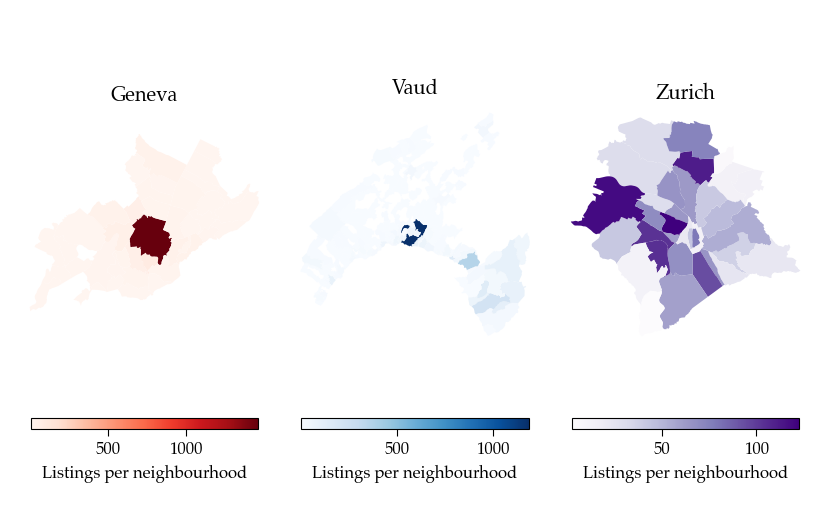

Most listings are densely situated in each of the regions' hotspots (Geneva City, Lausanne, and Zurich City respectively). 

**How are certain features distributed and correlated?** 

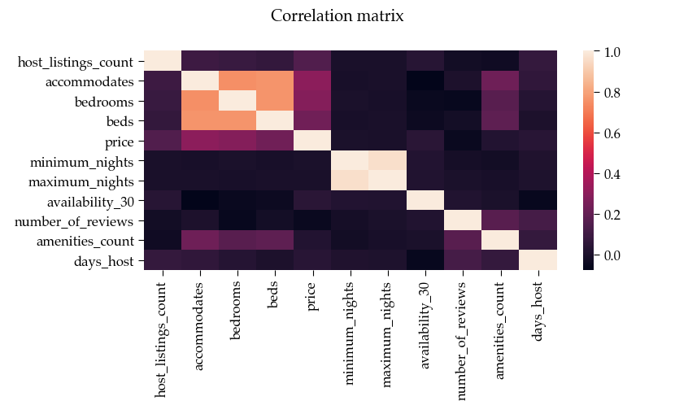

Most of the above-plotted correlations are not surprising (e.g. number of beds with number of bedrooms).

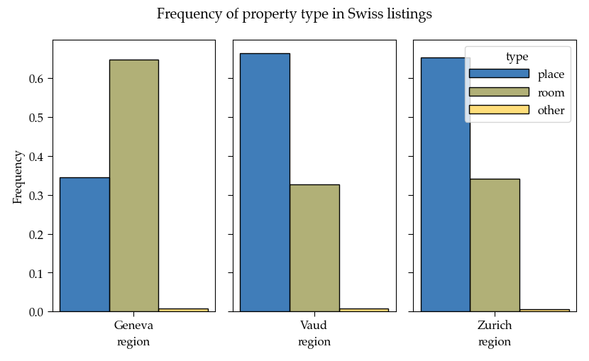

As can be observed, rooms are more frequent in Geneva whereas in Vaud and Zurich, it is more common to rent our one's entire place.

**How does this affect the distribution of prices for each property type?**

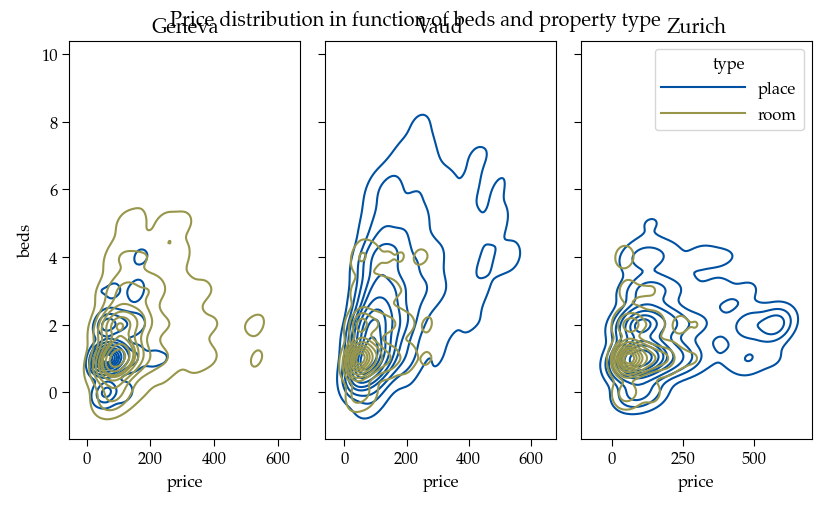

Vaud provides properties with a large number of beds. On the other hand, Geneva's small offering of entire places contain a surprisingly small amount of beds. The region of Zurich  contains a clear subset of pricy properties, and displays prices generally higher than the other Swiss regions.

**How are review scores correlated between different demands?**

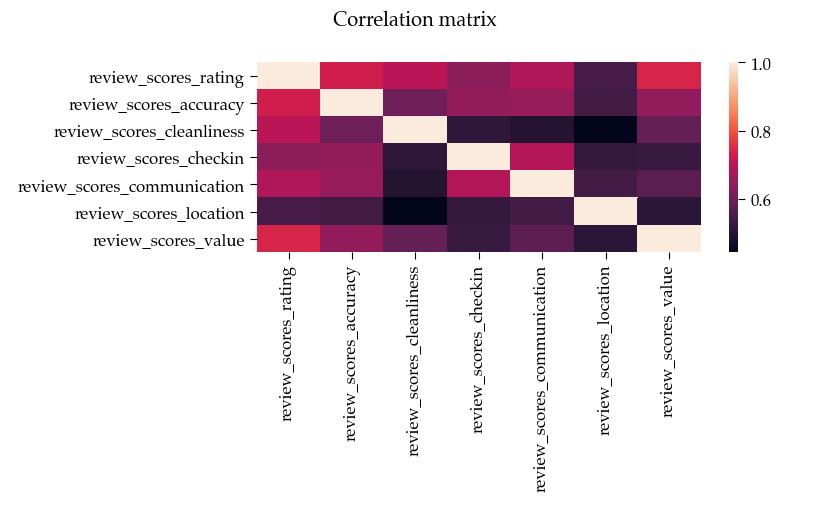

Cleanliness score is interestingly weakly correlated with the location score, whereas check-in and communication scores are highly correlated.

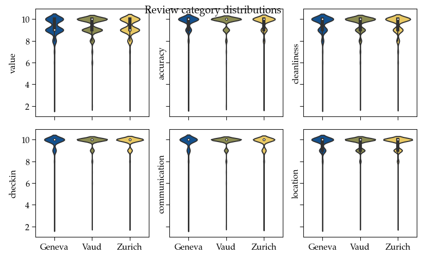

When comparing regions, Vaud receives the best reviews out of all Swiss regions. We can also observe that most reviews are very good.

**What words are most common in listing descriptions?**

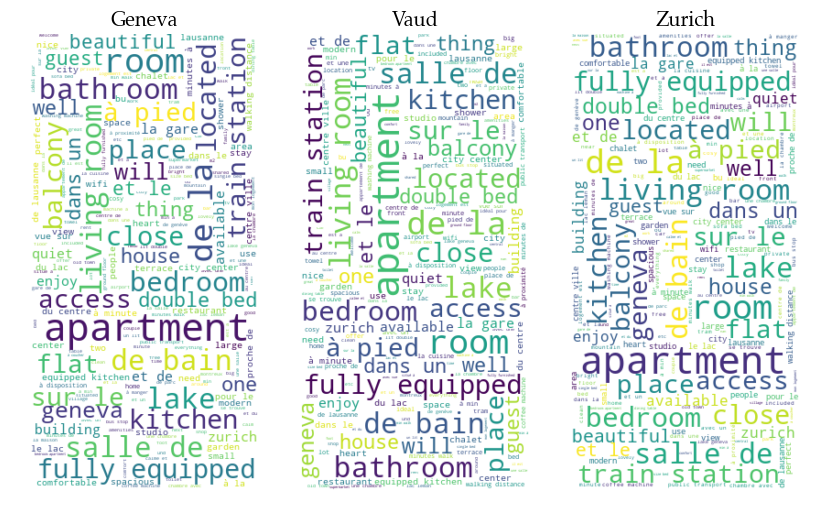

**What are the top amenities in properties?**
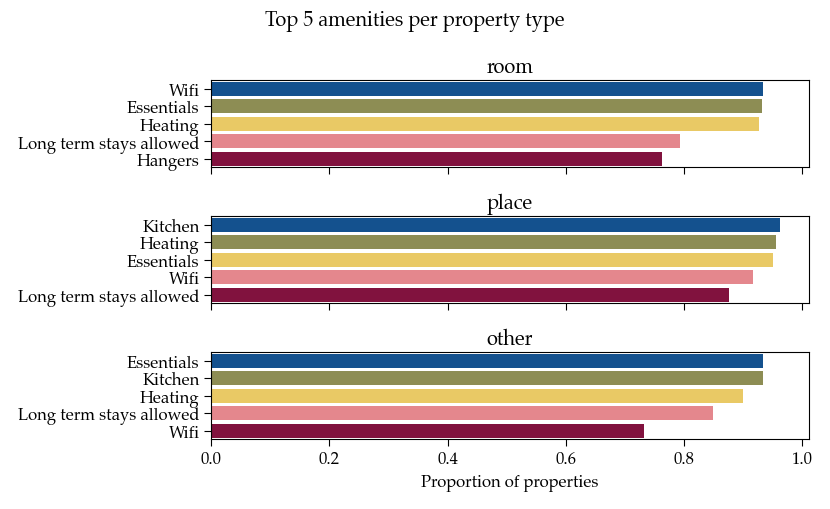

While Wifi and essentials are most important for rooms, kitchen and heating seem to predominate the entire place priorities. 

#### Calendar

What is the difference in average price between the three locations? 

We calculate the average price for each listing from the most recent price predictions (February 2021). Each listing is distributed into different average price categories of 100$ intervals. We plot the percentage of listings per category. 

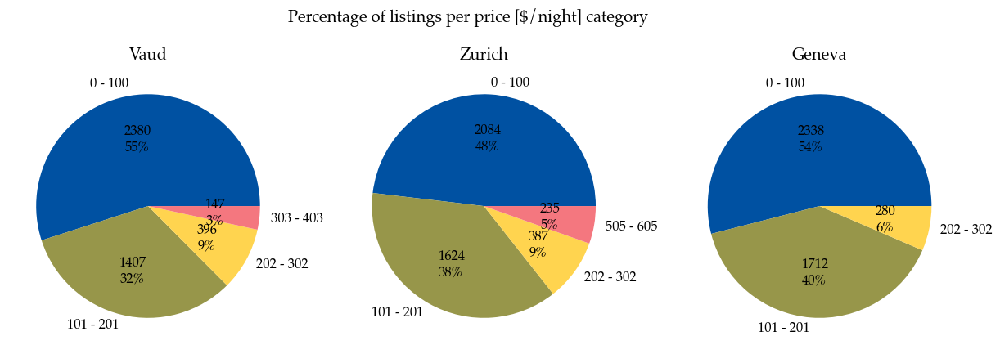

We see that Geneva and Vaud have more listings in the cheaper category than Zurich. Zurich also has a significant part of listings in the higher [500-600$/night] category compared to the others. 

Was there an impact of Covid-19 on price predictions? 

For each location and the first four price categories, we plot the time-series of average price predictions. This is done for four different predictions: before the pandemic (January 2020), during the first wave (May 2020) and second wave (December 2020-February 2021). We also add in local holidays (grey dotted lines) and significant dates of the pandemic (red dotted lines): 
*  13 March 2020: beginning of pandemic restrictions (mostly in the Romandie)
*  27 April 2020: some restrictions lifted in most cantons 
*  25 June 2020: most of the restrictions lifted in whole Switzerland
*  22 October 2020: beginning of second wave, restrictions back

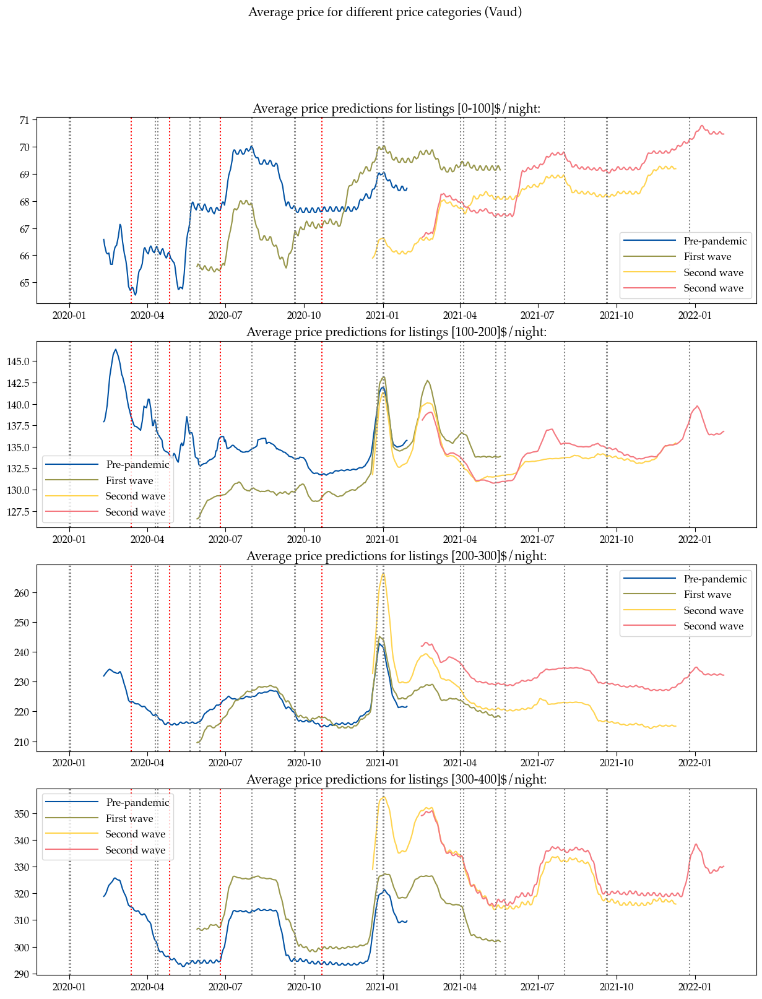
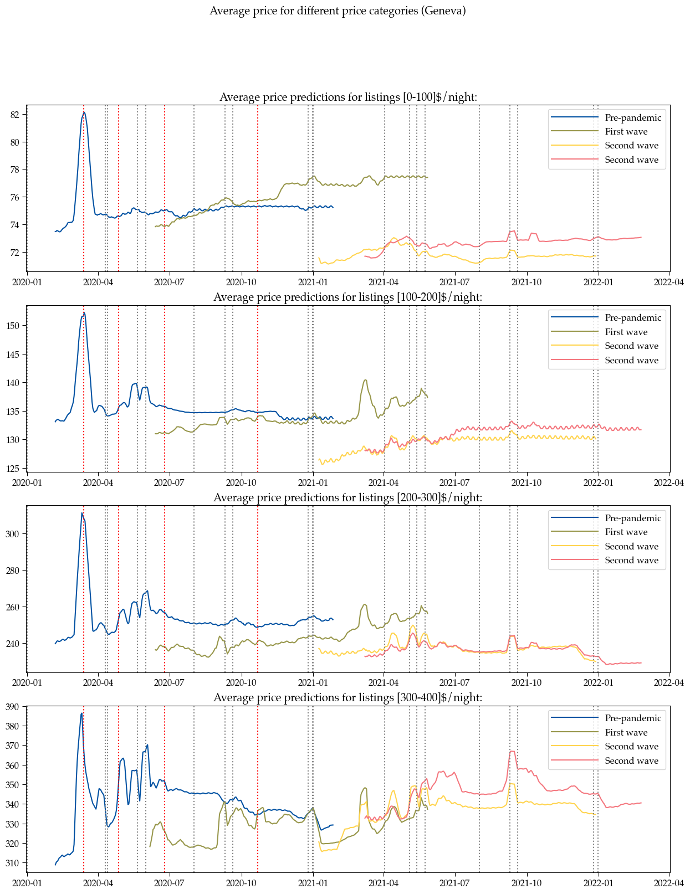
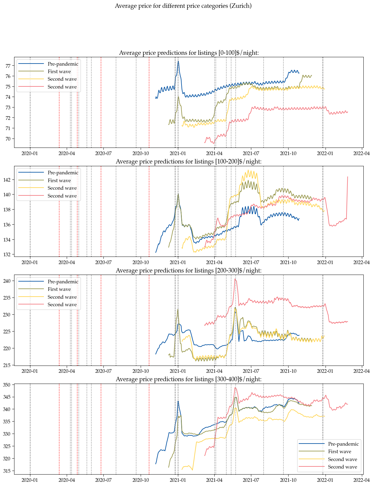

From these we gain a lot of insight, notably that price predictions in May 2020 are lower than those made pre-pandemic in almost all categories. Most drastically, the 13th of March had a very important drop in prices in Geneva. We see also the impact on prices from holidays such as Easter and New Year, with significant peaks.

#### Reviews

Reviews can represent Airbnb activity since users will typically review a listing they stayed at shortly after their stay. In this part, we inform ourselves of the overal trends of Airbnb activity within the three regions, limiting ourselves to the top 10 most-reviewed listings, since these are the most pertinent. 

Airbnb Activity :
From the figure we see the following, noting that in blue important COVID milestones are highlighted:
* Generally speaking, listings are reviewed primarily during the summer months
* Up until beginning of 2020 (COVID), the activity in all three regions was increasing
* Following the restrictions announced, activity all but ceased
* Following relaxation of restrictions in summer 2020, the area of Zurich rebounded earlier than the french-speaking regions

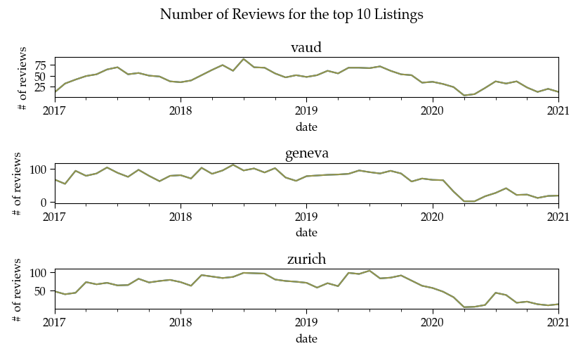

We wanted to gain a more detailed understanding of listings contained within the top 5 most-reviewed data. This allows us to study whether the more-reviewed listings are long established venues or whether they are attractive because they are new. In the first figure, we study the three areas, the second figure zooms in on the listings in Vaud.

We observe the following:
* Older listings are reviewed at a constant cyclic rate while newer listings have greater peaks of reviews than the other listings
* Zurich and Geneva being larger cities have more activity than the Vaud region
* Despite being the most reviewed listings, this did not save the listings' activites when the COVID restrictions were announced

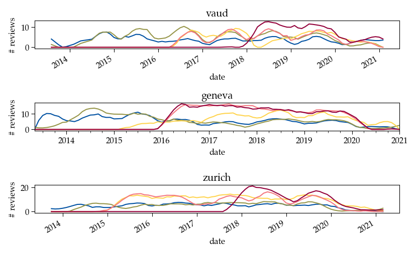
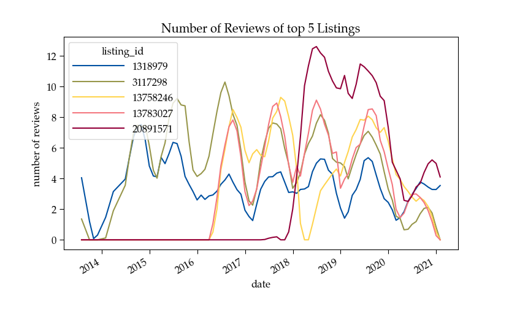


### Related work


> - What others have already done with the data?
> - Why is your approach original?
> - What source of inspiration do you take? Visualizations that you found on other websites or magazines (might be unrelated to your data).
> - In case you are using a dataset that you have already explored in another context (ML or ADA course, semester project...), you are required to share the report of that work to outline the differences with the submission for this class.

The Inside Airbnb platform aims to provide information regarding the effects of Airbnb listings and their effects on the economies of the housing and renting markets. The platform allows data visualization on the form of a map, given the different areas selected. 
We employ their data using an original approach as follows: we focus on 3 specific areas in Switzerland, selecting certain pertinent listings to reflect the local economy. We further aim to provide recommendations to both local tourists and listings owners in order to simultaneously (1) provide personalized recommandations regarding their expectation and (2) boost their visibility and learn from their clients' expectations to overcome the COVID aftermath.
Contrary to most Airbnb existing visualisations like [this one](https://www.kaggle.com/erikbruin/airbnb-the-amsterdam-story-with-interactive-maps), [this one](https://nycdatascience.com/blog/student-works/how-airbnb-is-in-nyc-interactive-data-visualization-in-r/) or [this one](http://www.columbia.edu/~sg3637/airbnb_final_analysis.html), we focus on the three regions available in Switzerland rather than focusing solely on a city. We are also analysing the data post-COVID restrictions, which gives more insight as to which airbnb locations may be more robust and what can owners do to reproduce such success.

Some inspiration :

 **COMPLETER**  

* [location and comparaison of attributes on a map](https://multimedia.scmp.com/infographics/news/world/article/3077057/europe-coronavirus/index.html)
* [uniform style and poignant story telling on complex probles](https://fingfx.thomsonreuters.com/gfx/rngs/FINANCIAL-CRISIS2008/0100805F0BK/index.html)
* [story telling and simple animations ](https://graphics.reuters.com/EUROPE-MIGRANTS/010070WZ1W2/index.html)


## Milestone 2 (7th May, 5pm)

**10% of the final grade**


## Milestone 3 (4th June, 5pm)

**80% of the final grade**


## Late policy

- < 24h: 80% of the grade for the milestone
- < 48h: 70% of the grade for the milestone

