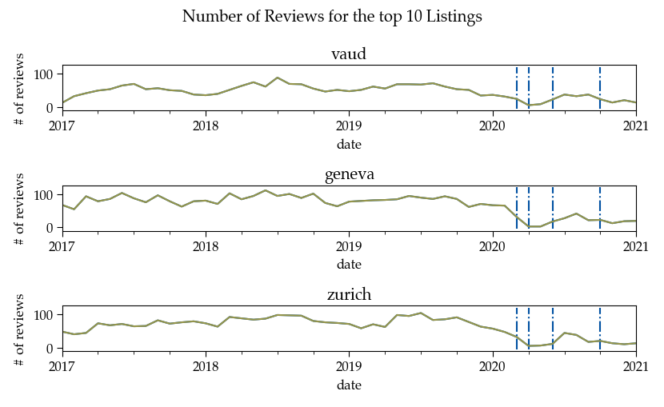

# Project of Data Visualization (COM-480)

| Student's name | SCIPER |
| -------------- | ------ |
| Charlyne Bürki | 261415 |
| Arnaud Dhaene  | 269883 |
| Marijn van der Meer | |

[Milestone 1](#milestone-1) • [Milestone 2](#milestone-2) • [Milestone 3](#milestone-3)

## Repository structure

```
├── assets
|   ├── figures      <- Figures generated that are incorporated in README.md
├── config
|   └── index.js   
├── data
|   ├── README.md    <- More info about data filenames
|   ├── geneva       <- Geneva region data
|   ├── vaud         <- Vaud region data
|   └── zurich       <- Zurich region data
├── notebooks        <- Python notebooks
|   └── eda.ipnyb
├── scripts
├── .gitignore
├── index.js
├── package.json
├── README.md        <- The current file
```

## Milestone 1 (23rd April, 5pm)

**10% of the final grade**

This is a preliminary milestone to let you set up goals for your final project and assess the feasibility of your ideas.
Please, fill the following sections about your project.

*(max. 2000 characters per section)*

### Dataset

> Find a dataset (or multiple) that you will explore. Assess the quality of the data it contains and how much preprocessing / data-cleaning it will require before tackling visualization. We recommend using a standard dataset as this course is not about scraping nor data processing.
>
> Hint: some good pointers for finding quality publicly available datasets ([Google dataset search](https://datasetsearch.research.google.com/), [Kaggle](https://www.kaggle.com/datasets), [OpenSwissData](https://opendata.swiss/en/), [SNAP](https://snap.stanford.edu/data/) and [FiveThirtyEight](https://data.fivethirtyeight.com/)), you could use also the DataSets proposed by the ENAC (see the Announcements section on Zulip).

The chosen dataset contains listings and reviews of Airbnb listings in Switzerland. The data is pulled from [Inside Airbnb](http://insideairbnb.com/get-the-data.html) for regions specified in [Project organization](##project-organization).

#### Structure of the data files

The latest data is updated on [Inside Airbnb](http://insideairbnb.com/get-the-data.html) every so often for each available region. The dataset that was processed in the framework of Milestone 1 consists of a merged dataset of the following regions:

* Geneva canton (2072 listings), data compiled on February 25, 2021
* Vaud canton (4344 listings), data compiled on February 04, 2021
* Zurich city (1806 listings), data compiled on February 26, 2021

Each of the above-mentioned regions contains the following information:

* Detailed Listings data, found in `listings-detailed.csv`
* Detailed Calendar data, found in `calendar.csv`
* Detailed Review data, found in `reviews-detailed.csv`
* Summary information and metrics for Listings, found in `listings.csv`
* Summary Review data and Listing ID, found in `reviews.csv`
* Neighbourhood list for geo filter, found in `neighbourhoods.csv`
* GeoJSON file or neighbourhoods of the region, found in `neighbourhoods.geojson`

In addition to this, archived data going back to January 2020 is available for some of the datasets. 

We focused on exploring Listings, Calendars and Reviews.

### Problematic

> Frame the general topic of your visualization and the main axis that you want to develop.
> - What am I trying to show with my visualization?
> - Think of an overview for the project, your motivation, and the target audience.

Because of the current pandemic, the hospitality sector has been hit hard. Regardless of recent relaxations of safety measures and the increase in vaccinations, we expect that this year again, holidays in Switzerland will be favoured and encouraged by the government for the Swiss population instead of going abroad. To encourage this, we plan on giving an insight into the best Airbnb locations in three major regions of Switzerland: Geneva, Vaud and Zurich. Through our visualisations, locals will have the ability to choose the best locations corresponding to their criteria and favour local tourism. Local Airbnb listings owners will equally benefit from more in-depth knowledge about the clients' demands at a regional level, allowing them to tailor their listing to the gathered data. In other words, they will be able to gain insights about the environment where they own a listing and will be able to adapt their offer to the regional demands.  

### Exploratory Data Analysis

> Pre-processing of the data set you chose
> - Show some basic statistics and get insights about the data

## Pre-processing
All pre-processing steps for each dataset can be found in `pre-processing.md`.

## Data Insights
#### Listings

**Where are the listings situated?**


Most listings are densely situated in each of the regions' hotspots (Geneva City, Lausanne, and Zurich City respectively). 

**How are certain features distributed and correlated?** 


Most of the above-plotted correlations are not surprising (e.g. number of beds with number of bedrooms).


Rooms are more frequent in Geneva whereas in Vaud and Zurich, it is more common to rent our one's entire place.

**How does this affect the distribution of prices for each property type?**


Vaud provides properties with a large number of beds, Geneva's small offering of entire places contain a small amount of beds and Zurich  contains a clear subset of pricy properties, and displays prices generally higher than the other Swiss regions.

**How are review scores correlated between different demands?**


Cleanliness score is interestingly weakly correlated with the location score, whereas check-in and communication scores are highly correlated.


When comparing regions, Vaud receives the best reviews out of all Swiss regions. We can also observe that most reviews are very good.

**What words are most common in listing descriptions?**


**What are the top amenities in properties?**


While Wifi and essentials are most important for rooms, kitchen and heating seem to predominate the entire place priorities. 

#### Calendar

**What is the difference in average price of listings between the three locations?**


Geneva and Vaud have more listings in the cheaper category than Zurich. Zurich also has a significant part of listings in the higher [500-600$/night] category compared to the others. 

**Was there an impact of Covid-19 on price predictions?**

For each location and the first four price categories, we plot the time-series of average price predictions. This is done for four different predictions: before the pandemic (January 2020), during the first wave (May 2020) and second wave (December 2020-February 2021). We also add in local holidays (grey dotted lines) and significant dates of the pandemic (red dotted lines): 
*  13 March 2020: beginning of pandemic restrictions (mostly in the Romandie)
*  27 April 2020: some restrictions lifted in most cantons 
*  25 June 2020: most of the restrictions lifted in whole Switzerland
*  22 October 2020: beginning of second wave, restrictions back


Price predictions in May 2020 are lower than those made pre-pandemic in almost all categories. More drastically, the 13th of March had a very important drop in prices in Geneva. We see also the impact on prices from holidays such as Easter and New Year.

#### Reviews

Reviews represent Airbnb activity since users will typically review a listing shortly after their stay. 

**Are there trends in Airbnb listings activity ?**



In blue are the significant dates of the pandemic. 

Listings are reviewed primarily during the summer months. Up until the beginning of 2020, the activity in all three regions was increasing. Following the annoucned restriction, activity all but ceased, though Zurich rebounded earlier than the french-speaking regions. 

**What are the characteristics of top listings across regions ?**

Older listings are reviewed at a constant cyclic rate while newer listings have greater peaks of reviews. Also, despite being the most-reviewed listings, their activities were still impacted following the restrictions announced. 


### Related work


> - What others have already done with the data?
> - Why is your approach original?
> - What source of inspiration do you take? Visualizations that you found on other websites or magazines (might be unrelated to your data).
> - In case you are using a dataset that you have already explored in another context (ML or ADA course, semester project...), you are required to share the report of that work to outline the differences with the submission for this class.

The Inside Airbnb platform provide information regarding the effects of Airbnb listings on the housing market economy. The platform allows data visualization in a map format. From it, one can select criterions to visualize certain listings.

 Though we employ their data, we distinguish ourselves by: 
* Focusing on 3 specific areas in Switzerland and selecting certain pertinent listings to reflect the local economy;
* Studying the Airbnb community post-COVID which, from our research, has not been done yet;
* Providing information to both local tourists and listings owners in order to simultaneously: 
    * give recommendations for their wants and needs  
    * boost the listings’ visibility to overcome the COVID aftermath.
 
Contrary to most Airbnb existing visualizations like [this one](https://www.kaggle.com/erikbruin/airbnb-the-amsterdam-story-with-interactive-maps)(a visualization of Amsterdam listings), [this one](https://nycdatascience.com/blog/student-works/how-airbnb-is-in-nyc-interactive-data-visualization-in-r/) (a question-and-answer study of NYC listings) or [this one](http://www.columbia.edu/~sg3637/airbnb_final_analysis.html) (an in-depth analysis of NYC Airbnb), we focus on the three regions available in Switzerland. We also analyze the data post-COVID restrictions, which yields more insight as to which Airbnb locations may be more robust and what can owners do to reproduce such success.

These visualizations provide inspiration for our project:
* [Europe’s Coronavirus Lockdown Nightmare](https://multimedia.scmp.com/infographics/news/world/article/3077057/europe-coronavirus/index.html) contains interesting visualizations that compare and contrast two areas of the world. We draw inspiration from the way the data is simply presented to showcase the differences, since we will have three regions to compare. 
* [Notes from the 2008 crisis:10 Years on](https://fingfx.thomsonreuters.com/gfx/rngs/FINANCIAL-CRISIS2008/0100805F0BK/index.html) provides an immersive story telling on a complex issue. The stylistically unique way of presenting the facts is equally impressive as it provides a mesmerizing experience. 
* [Europe Migrant Crisis: Displaced once more](https://graphics.reuters.com/EUROPE-MIGRANTS/010070WZ1W2/index.html) is a simple visualization story with added value in the animations and interactivity on their graphs. Given that we will have plots with timelines and additional information pertaining to certain timepoints, we find that this visualization is a good example to follow.

## Milestone 2 (7th May, 5pm)

**10% of the final grade**


## Milestone 3 (4th June, 5pm)

**80% of the final grade**


## Late policy

- < 24h: 80% of the grade for the milestone
- < 48h: 70% of the grade for the milestone

