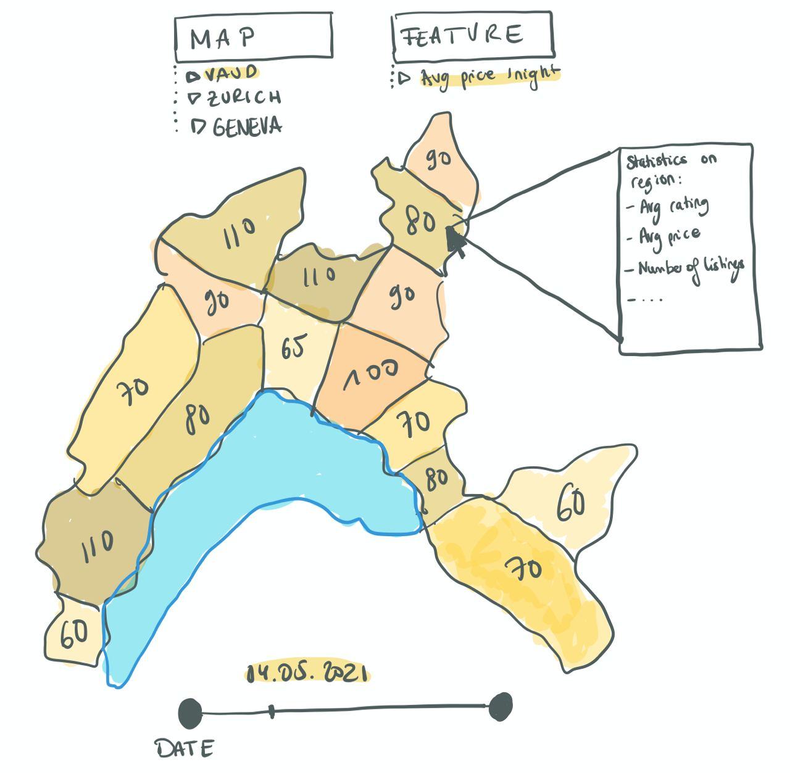
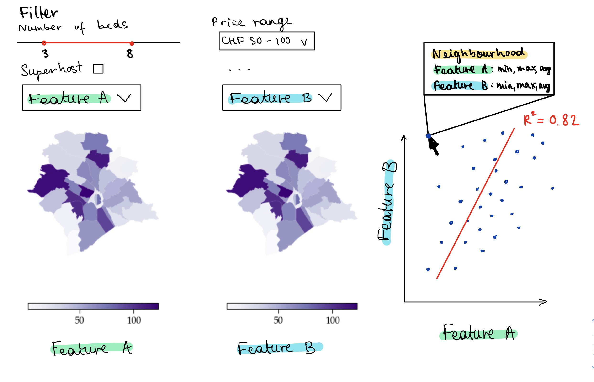
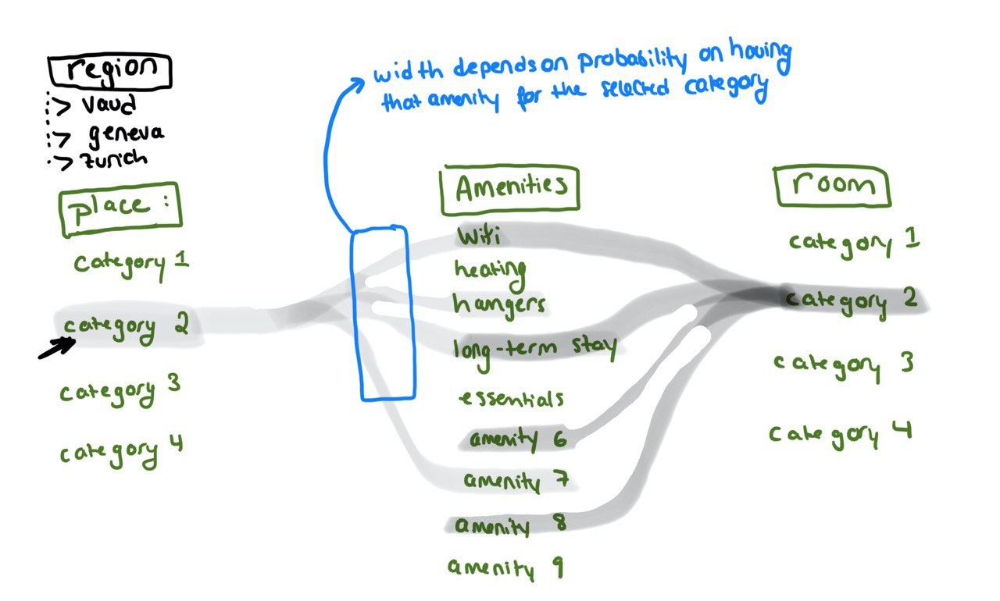
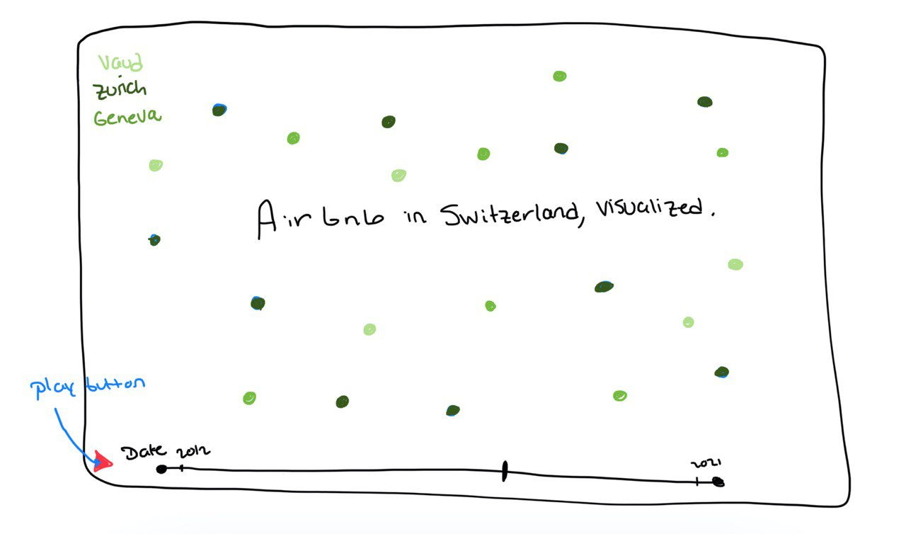

# Project of Data Visualization (COM-480)

| Student's name | SCIPER |
| -------------- | ------ |
| Charlyne Bürki | 261415 |
| Arnaud Dhaene  | 269883 |
| Marijn van der Meer | 247273 |

## Milestone 2 (7th May, 5pm)
**10% of the final grade**

### Introduction:
The goal of our project is to provide a platform for both Airbnb users and Airbnb listing owners (also known as hosts) in Switzerland. Since the tourism industry has been hit hard due to COVID-19 restrictions, our approach is twofold. In order to stimulate local tourism in Switzerland from this summer on, we aim to inform the Airbnb community about local Airbnb possibilities and give them more insight into different features. On the other hand, to allow listing owners to provide the best possible amenities to tourist and re-stimulate the private hospitality industry, we will show regional statistics and inputs about customer preferences. 

The entirety of our website will be accessible to both types of users. However, there will be two explicitly-labeled sections separate for users and owners. 

### Sketches and tools needed:
Before the interactive visualisations,  our site will exhibit general statistics pertaining to the three regions (Vaud, Geneva and Zurich) and Airbnb information. Because the goal is to stimulate Swiss tourism, the subsequent section will contain the de-confinement timeline outlined by the [Federal Council's proposal](https://www.admin.ch/gov/fr/accueil/documentation/communiques.msg-id-83303.html)(unfortunately, it’s not available in english). 

After that, we will have two buttons leading to the “insights for users” or “insights for hosts”.  Our main framework will contain 3 principle visualisation: 

### Visualisation 1: global insights about regional possibilities

Thanks to this interactive map, users will get to see regional statistics for Vaud, Geneva and Zurich. Unfortunately there is only information for the city of Zurich and not the canton, but all three areas are separated into districts. All districts will show the average price per night for the listings at that location. Districts will be shaded according to the average price/night category. This way, users will get an insight into the price range to expect per district. Furthermore, hovering above a district will give more overall statistical information about the listings in that region (e.g. average number of beds, average rating, etc). Finally, the user will have the ability to change the date to see the price evolution and choose accordingly.

tools needed:
most probably the lecture on maps (lecture 08). Because we want a shaded map, we will need tools on Choropleth maps. 

### Visualisation 2: 

This figure will allow users to interactively select two listing features. The features will be aggregated by listing neighborhood and displayed on two side-by-side Choropleth maps. Beside the maps will be a scatterplot of the two features and with a regression line. This will allow users to visualize the distribution of selected features within a map and investigate the relationship between listing aspects. Ultimately, this will allow them to gain insights with respect to the available listings in a specific region and make an informed decision about their potential upcoming stay. To dive deeper in this initiative, there will also be selection tools and sliders to filter out certain listings from the ones displayed on the map.

tools needed:
 
* Lecture 4 (D3)
* Lecture 5 (Interactive D3)
* Lecture 7 (Designing vizualisations)
* Lecture 8 (maps)

### Visualisation 3: further insights for owners 

First, the user will be able to select from the menu which region to select. The data is presented in a way that separates the types of Airbnb listings into two categories: renting a room or renting a full place (house or apartment). These categories are further divided into subcategories based on price ranges. For each subcategory, we will show which amenities are available for that price range by grouping edges and showcasing which is more likely with regards to the edge width. This will allow Airbnb owners to identify which common amenities are found for their listing’s price range and what they should add to better respond to the client’s demands. 

tools needed:
* items from the lecture on graphs (lecture 10), especially on edge groupings
* the reference on Sankey flow diagrams, as visualised [here](https://www.d3-graph-gallery.com/sankey.html).  

We wish to finish the website with a testimonials section where some of our friends will leave comments on employing our website. 

## To go further: 
Some other ideas that we could include should we see that the visualisations are insufficient in providing ample information to the users and owners include:

* The introductory visualisation of the Airbnb activity as a scatterplot of listings. This visualisation would trace the Airbnb activity  of reviews in the three regions, distinguished by three colours. The user would be able to select a time point throughout the available history, and be able to visualise the number of existing listings that were reviewed, indicating the Airbnb activity. Though not very quantitative, this visualisation could be an interesting qualitative visualisation that would draw attention and entice users to dig in deeper into the website. The inspiration comes from [Europe’s Coronavirus Lockdown Nightmare](https://multimedia.scmp.com/infographics/news/world/article/3077057/europe-coronavirus/index.html) introductory visualisation. 

* A complementary visualisation would be a bubble plot, plotting listing price vs the number of reviews obtained. For each listing, its “bubble” size would be proportional to the average score listed on Airbnb. This way, owners could observe whether a more expensive listing correlates to more reviews and whether this indicates a better rating. 

## Functional website:

The website skeleton is available [here](https://arnauddhaene.github.io/airbnb-visualized/). 

